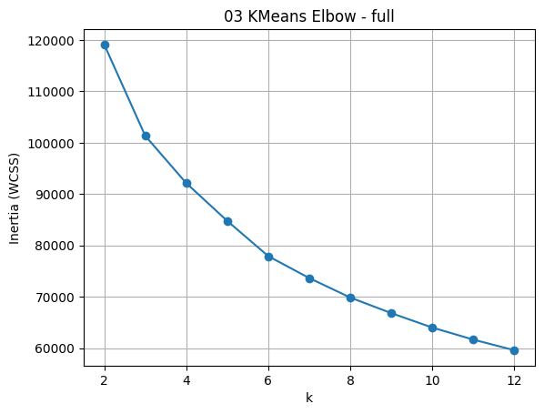
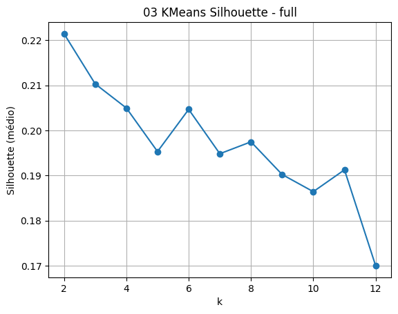

# Credit Card Clustering - Kaggle

## Objetivo

Aplicar técnicas de clusterização hierárquica e não hierárquica para segmentação de clientes de cartão de crédito. Baseado no dataset Credit Card Dataset for Clustering do Arjun Bhasin disponibilizado no kaggle (https://www.kaggle.com/datasets/arjunbhasin2013/ccdata).

## Modelos utilizados

- KMeans
- Hierarchical Clustering

## Métricas

- Silhouette Score
- Elbow method
## Bibliotecas principais

- pandas
- numpy
- scikit-learn
- matplotlib
- scipy
- pingouin

## Estrutura do Projeto

- data/
- notebooks/
- reports/
- src/

## Problema de negócio
Segmentar clientes de cartão de crédito com base no comportamento de uso (gastos, cash advance, pagamentos, limites, frequência etc.) para apoiar decisões de negócio (campanhas, risco, retenção, limites, benefícios).

- Pipeline reprodutível (EDA → preparação → modelagem → avaliação → interpretação).
- Comparação entre K-Means e Hierárquico.
- Perfis de segmentos (personas/descrições) e recomendações de ação.

## Dataset
O conjunto de dados resume o comportamento de uso de cerca de 9.000 titulares de cartões de crédito ativos durante os últimos 6 meses. O arquivo está em nível de cliente com 18 variáveis ​​comportamentais.

## Análise exploratória de Dados (EDA)

- Estrutura Geral do Dataset:
17 variáveis numéricas (após remover CUST_ID). Apenas 2 variáveis com missing.
Dataset limpo, sem problema sério de completude.
Não há duplicados.
A base é adequada para modelagem não supervisionada.

- Assimetria Extrema, Outliers e Escala:
Variáveis extremamente assimétricas (MINIMUM_PAYMENTS; ONEOFF_PURCHASES; PURCHASES; INSTALLMENTS_PURCHASES;PAYMENTS; CASH_ADVANCE_TRX; CASH_ADVANCE).
Distribuição heavy-tailed. Concentração massiva próxima de zero e poucos clientes com valores muito altos.
Risco de clusters serem formados por magnitude financeira extrema e não por padrão comportamental.
Sem padronização Clusters serão definidos apenas por limite e pagamentos e Frequência será irrelevante, então a padronização é obrigatória.

Obs:
- Existem subestruturas latentes naturais.

## Pré-processamento dos Dados

- creditcard_risk_zscore: Risco - Identificar bons e maus pagadores.
- creditcard_credit_behavior_zscore: Comportamento de Crédito - Identificar exposição e dependência de crédito.
- creditcard_consumption_zscore: Padrão de Consumo - Identificar padrão de consumo.
- creditcard_full_zscore: Dataset Completo - Clusterização global exploratória.

Encapsulamento: preprocessing.py

## Avaliação do KMeans e Escolha do Número de Clusters

A definição inicial do número de clusters foi baseada em métricas clássicas de avaliação:

- Elbow Method (Inertia / WCSS)  
- Silhouette Score  

Os resultados indicaram:

- Ausência de ponto de inflexão claro no gráfico de Elbow  

- Valores de Silhouette relativamente baixos (0.17 a 0.22)  

- Melhor valor de Silhouette em **K = 2**

Apesar de K = 2 apresentar o maior valor de Silhouette, a análise qualitativa revelou uma segmentação excessivamente simplificada, basicamente separando:

- Clientes com bom comportamento financeiro  
- Clientes com maior risco  

Essa divisão binária não atende ao objetivo do projeto, pois não captura nuances relevantes do comportamento dos clientes.

Dado que:

- Diferença de Silhouette entre K = 2, 3 e 4 é pequena  
- O método do Elbow não apresenta definição clara  
- Os dados possuem comportamento contínuo, sem separações naturais bem definidas  

Foi adotada uma abordagem orientada ao negócio:

> A escolha do número de clusters deve priorizar interpretabilidade e utilidade prática, e não apenas métricas matemáticas.

---

### Escolha Final: K = 4

O modelo com **K = 4** foi selecionado por oferecer melhor granularidade e permitir a definição de perfis mais distintos e acionáveis.

---

### Perfis de Clientes Identificados

#### Cluster 0 — Clientes Premium de Alto Valor

**Características:**

- Alto volume de compras  
- Alto valor em compras pontuais (one-off)  
- Alta frequência de transações  
- Limites de crédito elevados  
- Pagamentos consistentes  
- Baixa utilização de cash advance  

**Interpretação:**

Clientes com alto engajamento e bom comportamento financeiro.

**Ações recomendadas:**

- Ofertas de aumento de limite  
- Produtos premium (cartões Black, Platinum)  
- Programas de fidelidade e benefícios exclusivos  

---

#### Cluster 1 — Clientes de Alto Risco e Dependência de Crédito

**Características:**

- Baixo volume de compras  
- Alta utilização de cash advance  
- Alta frequência de uso de crédito emergencial  
- Baixo percentual de pagamento total  
- Sinais de possível endividamento  

**Interpretação:**

Clientes com comportamento financeiro mais arriscado.

**Ações recomendadas:**

- Monitoramento de risco  
- Restrição de crédito  
- Estratégias de prevenção de inadimplência  

---

#### Cluster 2 — Clientes Parceladores Saudáveis

**Características:**

- Uso frequente de compras parceladas  
- Consumo moderado  
- Baixa utilização de cash advance  
- Percentual razoável de pagamento total  

**Interpretação:**

Clientes com comportamento planejado e controlado.

**Ações recomendadas:**

- Ofertas de parcelamento inteligente  
- Incentivo a consumo recorrente  
- Produtos financeiros voltados ao planejamento  

---

#### Cluster 3 — Clientes de Baixo Engajamento (Inativos)

**Características:**

- Baixo volume de compras  
- Baixa frequência de uso  
- Baixo saldo e movimentação  
- Baixo nível de pagamentos  

**Interpretação:**

Clientes com baixa utilização do cartão.

**Ações recomendadas:**

- Campanhas de ativação  
- Incentivos de uso (cashback, bônus)  
- Estratégias de retenção  

---

### Qualidade dos Clusters

Os valores de Silhouette indicam separação moderada/baixa entre clusters. Isso sugere que o comportamento dos clientes forma um espectro contínuo, e não grupos totalmente bem definidos.

Outras configurações de clusterização (ex: K = 3, K = 5) poderiam ser igualmente válidas, desde que:

- Produzam segmentos interpretáveis
- Sejam úteis para tomada de decisão
- Se alinhem com regras de negócio

Com isso é possível evidenciar que A utilização de K = 4 permitiu capturar diferentes perfis de clientes, equilibrando rigor técnico e aplicabilidade de negócio.
